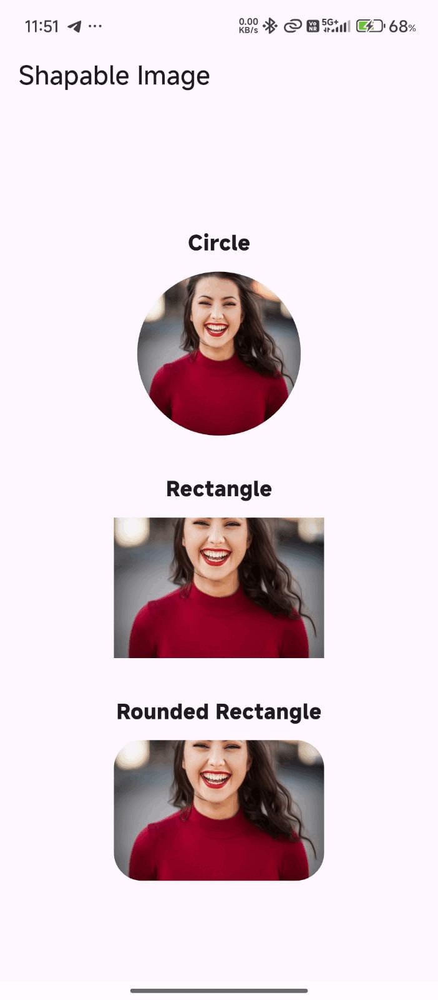

# flutter_shapable_image

A simple and customizable Flutter widget for displaying network images in different shapes such as **circle, rectangle, and rounded rectangle**.

## ✨ Features

* 🟢 Display images as a **circle**
* ▭ Display images as a **rectangle**
* 🔲 Display images as a **rounded rectangle**
* 🎨 Customizable width and height
* 🖼️ Supports Flutter's `BoxFit`
* 🔄 Works with network images
* ⚡ Lightweight and easy to use
* 📱 Works with Android, iOS, Web, Windows, macOS, and Linux

## 📸 Demo

<p align="center">
  
</p>

## 📦 Installation

Add `flutter_shapable_image` to your `pubspec.yaml`:

```yaml
dependencies:
  flutter_shapable_image: ^1.0.0
```

Then run:

```bash
flutter pub get
```

## 🚀 Usage

Import the package:

```dart
import 'package:flutter_shapable_image/flutter_shapable_image.dart';
```

### Circle

```dart
ShapableImage(
  imageUrl: 'https://example.com/image.jpg',
  width: 140,
  height: 140,
  shape: ImageShape.circle,
)
```

### Rectangle

```dart
ShapableImage(
  imageUrl: 'https://example.com/image.jpg',
  width: 220,
  height: 140,
  shape: ImageShape.rectangle,
  fit: BoxFit.cover,
)
```

### Rounded Rectangle

```dart
ShapableImage(
  imageUrl: 'https://example.com/image.jpg',
  width: 220,
  height: 140,
  shape: ImageShape.roundedRectangle,
  borderRadius: 24,
  fit: BoxFit.cover,
)
```

## 🎯 Available Shapes

| Shape                         | Description                             |
| ----------------------------- | --------------------------------------- |
| `ImageShape.circle`           | Displays the image as a circle          |
| `ImageShape.rectangle`        | Displays the image as a rectangle       |
| `ImageShape.roundedRectangle` | Displays the image with rounded corners |

## ⚙️ Properties

| Property       | Type         | Description                                   |
| -------------- | ------------ | --------------------------------------------- |
| `imageUrl`     | `String`     | URL of the image to display                   |
| `width`        | `double`     | Width of the image                            |
| `height`       | `double`     | Height of the image                           |
| `shape`        | `ImageShape` | Shape of the image                            |
| `borderRadius` | `double`     | Corner radius for rounded rectangles          |
| `fit`          | `BoxFit`     | Controls how the image fits inside the widget |

## 🖼️ Image Fitting

The `fit` property uses Flutter's standard `BoxFit` options.

For example:

```dart
ShapableImage(
  imageUrl: 'https://example.com/image.jpg',
  width: 220,
  height: 140,
  shape: ImageShape.roundedRectangle,
  borderRadius: 20,
  fit: BoxFit.contain,
)
```

Use:

* `BoxFit.cover` — fills the entire widget but may crop parts of the image.
* `BoxFit.contain` — displays the complete image but may leave empty space.
* `BoxFit.fill` — stretches the image to fill the widget.
* `BoxFit.fitWidth` — fits the image to the available width.
* `BoxFit.fitHeight` — fits the image to the available height.

## 📱 Complete Example

```dart
import 'package:flutter/material.dart';
import 'package:flutter_shapable_image/flutter_shapable_image.dart';

void main() {
  runApp(const ShapableImageExampleApp());
}

class ShapableImageExampleApp extends StatelessWidget {
  const ShapableImageExampleApp({super.key});

  @override
  Widget build(BuildContext context) {
    return MaterialApp(
      debugShowCheckedModeBanner: false,
      title: 'Shapable Image',
      home: const ShapableImageDemo(),
    );
  }
}

class ShapableImageDemo extends StatelessWidget {
  const ShapableImageDemo({super.key});

  static const String imageUrl =
      'https://images.unsplash.com/photo-1500648767791-00dcc994a43e'
      '?auto=format&fit=crop&w=800&q=80';

  @override
  Widget build(BuildContext context) {
    return Scaffold(
      appBar: AppBar(
        title: const Text('Shapable Image'),
      ),
      body: Center(
        child: SingleChildScrollView(
          child: Column(
            mainAxisAlignment: MainAxisAlignment.center,
            children: [
              const Text(
                'Circle',
                style: TextStyle(
                  fontSize: 18,
                  fontWeight: FontWeight.bold,
                ),
              ),
              const SizedBox(height: 12),
              const ShapableImage(
                imageUrl: imageUrl,
                width: 140,
                height: 140,
                shape: ImageShape.circle,
              ),
              const SizedBox(height: 32),

              const Text(
                'Rectangle',
                style: TextStyle(
                  fontSize: 18,
                  fontWeight: FontWeight.bold,
                ),
              ),
              const SizedBox(height: 12),
              const ShapableImage(
                imageUrl: imageUrl,
                width: 220,
                height: 140,
                shape: ImageShape.rectangle,
                fit: BoxFit.cover,
              ),
              const SizedBox(height: 32),

              const Text(
                'Rounded Rectangle',
                style: TextStyle(
                  fontSize: 18,
                  fontWeight: FontWeight.bold,
                ),
              ),
              const SizedBox(height: 12),
              const ShapableImage(
                imageUrl: imageUrl,
                width: 220,
                height: 140,
                shape: ImageShape.roundedRectangle,
                borderRadius: 24,
                fit: BoxFit.cover,
              ),
            ],
          ),
        ),
      ),
    );
  }
}
```

## 📁 Project Structure

```text
flutter_shapable_image/
├── android/
├── ios/
├── lib/
│   ├── flutter_shapable_image.dart
│   └── src/
│       └── shapable_image.dart
├── example/
│   ├── lib/
│   │   └── main.dart
│   └── pubspec.yaml
├── test/
├── demo.gif
├── CHANGELOG.md
├── LICENSE
├── pubspec.yaml
└── README.md
```

## 🛠️ Requirements

* Flutter SDK
* Dart SDK

The package is built using Flutter's standard widget system and does not require any additional state-management package.

## 🤝 Contributing

Contributions are welcome.

1. Fork the repository.
2. Create a new branch.
3. Make your changes.
4. Test the package.
5. Create a pull request.

## 📄 License

MIT License

Copyright (c) 2026 Excelsior Technologies

Permission is hereby granted, free of charge, to any person obtaining a copy
of this software and associated documentation files (the "Software"), to deal
in the Software without restriction, including without limitation the rights
to use, copy, modify, merge, publish, distribute, sublicense, and/or sell
copies of the Software, and to permit persons to whom the Software is
furnished to do so, subject to the following conditions:

The above copyright notice and this permission notice shall be included in all
copies or substantial portions of the Software.

THE SOFTWARE IS PROVIDED "AS IS", WITHOUT WARRANTY OF ANY KIND, EXPRESS OR
IMPLIED, INCLUDING BUT NOT LIMITED TO THE WARRANTIES OF MERCHANTABILITY,
FITNESS FOR A PARTICULAR PURPOSE AND NONINFRINGEMENT. IN NO EVENT SHALL THE
AUTHORS OR COPYRIGHT HOLDERS BE LIABLE FOR ANY CLAIM, DAMAGES OR OTHER
LIABILITY, WHETHER IN AN ACTION OF CONTRACT, TORT OR OTHERWISE, ARISING FROM,
OUT OF OR IN CONNECTION WITH THE SOFTWARE OR THE USE OR OTHER DEALINGS IN THE
SOFTWARE.
